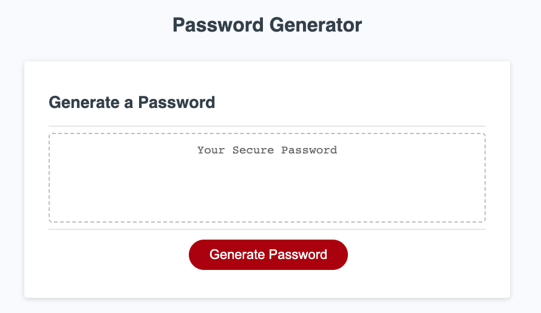
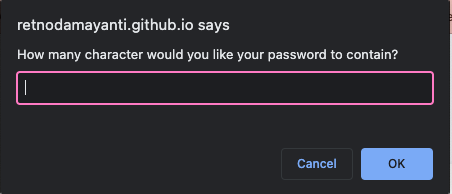
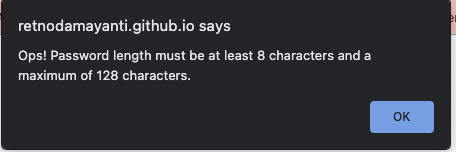
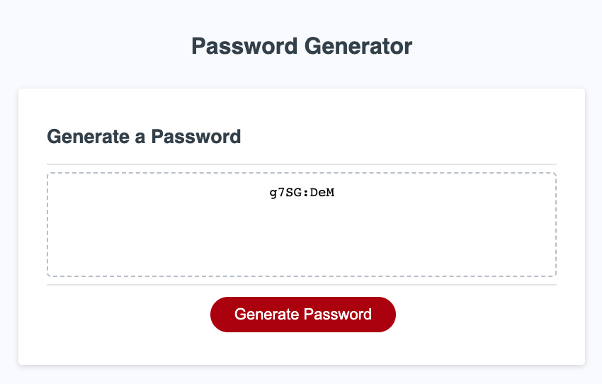

# Password Generator - JavaScript

## Description

This application was built to generate a password using JavaScript program. User need to click the button "Generate Password" and user will be asked to input the length of password character and whether they would like to include password criteria such as lowercase, uppercase, numeric, and special character. In this application, user will need to select at least 1 criteria password. Once the User input and confirm the prompt, then a password will be generated inside the text box.

Please visit the application here: [Generate Password](https://retnodamayanti.github.io/generate_password_javascript/)

## Installation

N/A

## Usage
- The screenshot below display the application 

- The screenshot below shows a prompt message for the user to enter the password length

- The screenshot below shows an error message when user enters invalid character length.

- The screenshot below shows a password has been generated.

 
## Credit
- https://developer.mozilla.org/en-US/docs/Web/JavaScript/Reference/Operators/Logical_AND)
- https://dev.to/code_mystery/random-password-generator-using-javascript-6a
- https://www.tutorialstonight.com/password-generator-in-javascript
- https://git.bootcampcontent.com/University-of-Adelaide/UADEL-VIRT-FSF-PT-03-2023-U-LOLC/-/tree/main/03-JavaScript/02-Challenge
## License

Please refer to the LICENSE in the repo.